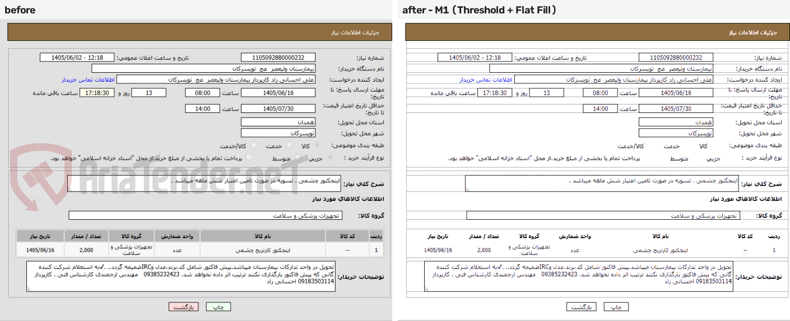
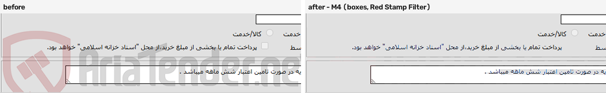
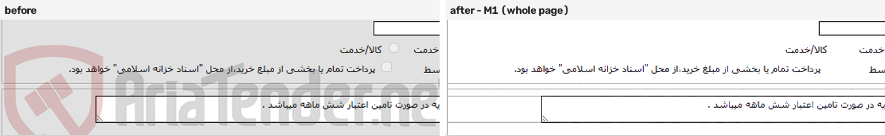
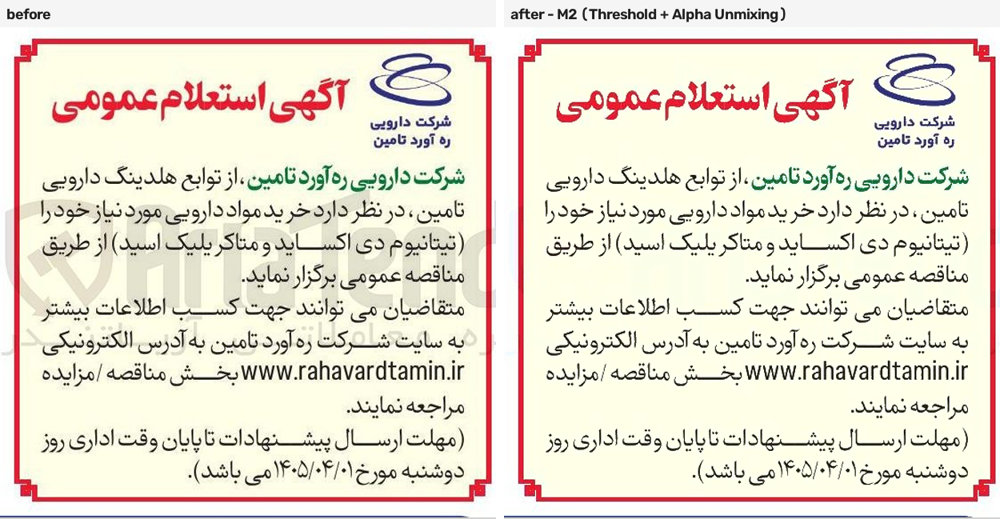
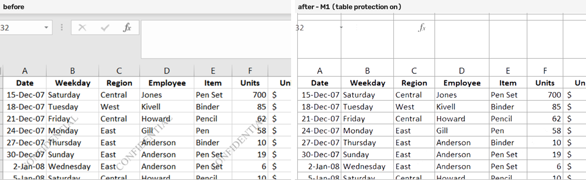
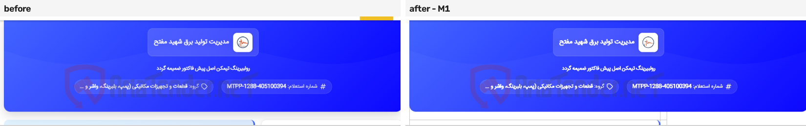
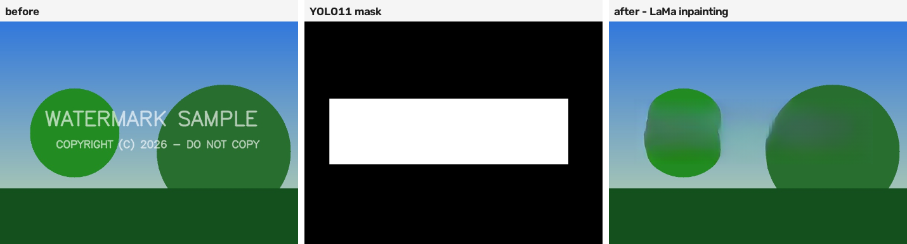

# Watermark Remover Suite

A Gradio app for removing watermarks from **scanned documents** (Persian tender notices, forms,
portal pages, spreadsheets) and from **natural photos**. Documents are handled by four selectable
methods that all share one hard rule — never touch a pixel you haven't positively identified as
watermark — while photos go through YOLO detection plus LaMa inpainting.

The document side targets one watermark family in particular: the **AriaTender** mark that
[aria-tender.net](https://aria-tender.net) stamps onto the tender notices it republishes. It comes
in two variants, a wide "AriaTender.neT" wordmark with a pink shield-and-gavel glyph, and a stacked
logo with a Persian subtitle underneath. Both are semi-transparent grey ink over paper.

```
python app.py      # opens http://127.0.0.1:7860 in your browser
```

---

## Contents

- [Status](#status)
- [Install](#install)
- [The interface](#the-interface)
- [Document methods](#document-methods)
- [Photo inpainting](#photo-inpainting)
- [Models](#models)
- [Algorithms that use no model](#algorithms-that-use-no-model)
- [Examples](#examples)
- [Known issues](#known-issues)
- [Training and data pipeline](#training-and-data-pipeline)
- [Evaluation](#evaluation)
- [Repository layout](#repository-layout)

---

## Status

Works well on the common case and fails in specific, documented ways on the rest.

- **What works:** the wide AriaTender mark on standard tender-portal forms. Across the 73 real pages
  in `wm_testset/images/`, 61 are that layout, and every detection model finds the mark on all of
  them.
- **What doesn't:** large faint marks that span the page, non-AriaTender watermarks, and a handful of
  page elements the models mistake for watermarks. See [Known issues](#known-issues) for the
  measured breakdown.
- **What isn't measured:** there is no hand-labelled real test set, so every quality claim here comes
  from either synthetic validation or visual review. `wm_testset/README.md` defines the label format
  for filling that gap.

---

## Install

```bash
pip install -r requirements.txt
```

`requirements.txt` pins Torch 2.6.0 / TorchVision 0.21.0. For GPU use, install the CUDA build that
matches your driver from [pytorch.org](https://pytorch.org/get-started/locally/); this project was
developed against `torch==2.6.0+cu124`. The app runs on CPU, just slower.

**Weights.** Everything the app loads is committed under `weights/`, except one file that exceeds
GitHub's 100 MB limit:

| Missing file | Needed by |
|---|---|
| `weights/yolo11_watermark_general.pt` (110 MB) | The Photo tab's default detector, and M3's "YOLO11 General" / "Both (Union)" model choices |

Put it in `weights/` yourself. Everything else runs without it.

LaMa inpainting downloads its own checkpoint on first use through the `simple-lama-inpainting`
package. The `lama/` directory in this repo is a reference clone of the original research code and
is **not** used at runtime.

---

## The interface

Five tabs, all served by `app.py` → `watermark_remover/ui.py`.

| Tab | What it does |
|---|---|
| **✨ Auto (Recommended)** | Classifies your upload as document or photo, then runs that pipeline with default settings. The guess and its confidence are shown, and you can override it before running. |
| **📄 1-Click Document Cleaner** | The four document methods (M1–M4), each with its own settings panel. |
| **🔍 M3 Detection Debug** | Runs M3's detection, mask refinement and false-positive filter, and removes nothing. Green tint = accepted mask, red = rejected, with the reason per instance. |
| **🔍 M4 Detection Debug** | Runs M4's detection and removal and renders only a diff. The amber tint marks the exact pixels M4 would change inside each box. |
| **🎨 Photo Inpainter** | YOLO detection plus LaMa, or paint the mask yourself with a brush. |

The debug tabs exist because a blank result is ambiguous. "Nothing was detected", "everything was
detected and then rejected by the filter" and "the mask is in the wrong place" all produce the same
unchanged page.

### Auto-routing

`classifier.py` computes a few colour and geometry features (dominant-colour coverage, paper
coverage, colour saturation, and so on) and combines them in a weighted sum rather than hard
cutoffs, so no single outlier flips the route on its own. Confidence is reported honestly, and it's
low when the features disagree. A strong table/grid signal overrides the score, since spreadsheets
can otherwise read as photos.

---

## Document methods

All four are on the Document tab, chosen with the **Cleaning Method** radio. Each has its own
settings group; the others hide themselves.

### Shared: Smart Auto-Pilot

On by default for M1/M2. `doc_core.auto_detect_document_profile` inspects the page and sets the
background mode, table protection, gridline thickness and contrast, and anti-aliasing for you. It
detects tables with 1-D top-hat filters plus projection peaks, finds the page frame with Canny
contours, and samples the outer margin and inner paper colours separately.

### M1 — Threshold + Flat Fill (Original)

The project's original algorithm, preserved bug-for-bug (the frozen reference copy is in
`tests/reference/legacy_document_cleaner.py`). An Otsu threshold splits the page into ink and
not-ink; everything brighter than the threshold is blended toward an estimated background colour.

- **Fast**, well under a second per page, with no model involved.
- **Whole-page**, so it works regardless of whether a detector recognises the mark.
- **Erases any light content along with the mark**: faint rules, light text, grey panels. The
  gridline protect/snap/redraw machinery exists to claw table borders back afterwards.

**Options:** Background Fill Mode (dual-zone / inner tint / pure white), Threshold Fine-Tuning
(−40…+40 around Otsu), Protect Table Gridlines, Snap & Straighten Gridlines, Soft Anti-Aliasing,
Gridline Target Thickness, Gridline Contrast, and a Stamp Colour Filter (read the red or blue
channel instead of grey, which makes a red or blue rubber stamp read as bright and get erased).

### M2 — Threshold + Alpha Unmixing

Identical to M1 in every stage except removal. Instead of flattening a pixel to the background
colour, it solves `observed = alpha·mark + (1 − alpha)·true` for the true pixel
(`unmixer.unmix_region`). Keeping everything else identical means any difference between M1 and M2
isolates that one variable.

- **Recovers content under the mark** rather than painting over it, where the blend is partial.
- **Still whole-page and threshold-driven**, so it shares M1's exposure to light real content.
- Above an alpha of 0.75 recovery is numerically unreliable, so it blends back toward the flat
  background.

### M3 — Segmentation + Deblending

A YOLO11-seg model produces per-instance masks; removal runs **only inside those masks**.

**Hard invariant:** every pixel outside the union of accepted masks is byte-identical to the input.

Pipeline: segment → false-positive filter → per-instance local-ring background → optional two-tone
colour split → removal strategy.

**False-positive filter** (`segmenter.py`). Each candidate instance is scored and can be rejected:

| Rule | Threshold | Purpose |
|---|---|---|
| Opaque ink | median alpha ≥ 0.97 (direct-mask models) or ≥ 0.78 (legacy box models) | A fully opaque region is more likely real ink than a translucent overlay. |
| Coloured UI chrome | local background saturation ≥ 60 | Rejects title bars and coloured app chrome. Switched off by the "Allow Watermarks on Coloured Banners" checkbox, and relaxed automatically when ≥ 2 confident instances share a coloured banner. |
| Excessive coverage | ≥ 50% of the page (direct-mask) or ≥ 5% (legacy box models) | Catches a mask that has flooded far past a single instance. |

**Removal strategies:**

| Strategy | How it works | Trade-off |
|---|---|---|
| **Template Deblending** (default) | Registers the real, photometrically calibrated mark (`template_match.py`) to each instance: one scale/rotation for the page, translation per instance, matched by normalised cross-correlation. Per-pixel alpha and ink then become *known*, so the compositing inverse clears the mark completely. | Best quality, and the only strategy with no grey ghost. Needs the calibrated asset and a good registration score; falls back per instance to Bounded Subtractive. |
| **Bounded Subtractive** | Estimates one darkening vector D per instance (85th percentile of background − observed over non-ink pixels) and adds back at most D per pixel. Nothing is ever replaced outright. | Safe on table rules and text: a rule pixel can lift a little but can never jump to paper white. Because D is sized to the typical mark pixel, the darkest half of the mark is capped short and leaves a faint grey ghost. |
| **Container-Aware Adaptive Fill** | Fills masked pixels from the local background of their own row segment, bounded by detected table rules and box borders, ignoring chromatic pixels when sampling paper (`container_cleaner.py`). | Stops colour leaking between a grey header and a white cell. It is a fill, so content under the mask is not recovered. |
| **Telea Inpainting** | Classical OpenCV inpainting inside the mask. | Fast fallback. Invents plausible texture, so it can smudge. |

**Options:** Segmentation Confidence (0.05–0.9, default 0.25), Segmentation Model, Refine with SAM
(legacy box models only), Removal Strategy, Allow Watermarks on Coloured Banners.

### M4 — Detection + Box Deblending

A detection-only YOLO model returns plain boxes (no masks), and removal happens inside each box.
There is no false-positive filter: a bare box doesn't carry the signal M3's filter measures.

**Hard invariant:** every pixel outside the union of padded boxes is byte-identical to the input.

Both threshold-based strategies read a **per-pixel background map** rather than one flat colour per
box (`estimate_background_map`). A box often straddles two zones, such as a grey form panel and a
white field; a single ring median would land between them and repaint the darker zone the wrong
shade.

| Strategy | How it works | Trade-off |
|---|---|---|
| **Threshold + Flat Fill (per box)** (default) | M1's threshold maths restricted to each box, flattening to the background map. | Simple and fast. Light real content inside a box is flattened too, and anything darker than the page's Otsu threshold survives. |
| **Bounded Subtractive (per box)** | M3's bounded correction adapted to a box, skipping pixels classified as real ink. | Never replaces a pixel. Leaves the same grey ghost as M3's bounded path. |
| **Alpha Network (per box)** | Runs the trained `AlphaUNet` over the padded union of boxes and inverts its predicted per-pixel opacity: `true = (observed − alpha·ink) / (1 − alpha)`. No threshold and no background estimate. | Cannot invent content: where predicted alpha is 0, the pixel is unchanged. Quality depends on how well its synthetic training transfers to real scans, which is unmeasured. Needs `weights/alpha_net_best_final.pt`; without it the page comes back unchanged with a message. |

**Options:** Detection Confidence, Detection Model, Box Padding (0–20 px), Removal Strategy,
Threshold Fine-Tuning, Soft Anti-Aliasing, Stamp Colour Filter.

### Speed

Measured on this machine (RTX GPU, CUDA) over the 9 test pages used for the examples below,
median wall-clock per page, including model loading amortised over the run:

| Method | Median | Slowest page |
|---|---|---|
| M1 | 0.16 s | 0.6 s |
| M2 | 0.56 s | 2.9 s |
| M4, threshold or bounded | 0.8–1.1 s | 1.4 s |
| M4, alpha network | 1.3 s | 3.2 s |
| M3, bounded or container fill | ~5 s | 31 s |
| M3, template deblending | ~28 s | 180 s |

Template registration is by far the most expensive step: it searches a scale/rotation grid per page
and then refines translation per instance. The pages it is slowest on are the large ones with many
instances.

### Which method to use

| Situation | Method |
|---|---|
| AriaTender mark on a tender form or portal page | **M3** with Template Deblending |
| Same, but the mask misses parts of the mark | **M4**, whose boxes cover more ground than the seg masks |
| Table or spreadsheet whose gridlines matter | **M1/M2** with table protection, or M3 with Container-Aware Fill |
| A watermark no model recognises | **M1** or **M2**: they need no detector |
| Content under the mark must survive | **M2**, or M3/M4 with a bounded or alpha-network strategy |

---

## Photo inpainting

For natural photos and opaque logos, where there's no paper to restore.

1. **Detect.** YOLO11 finds watermark boxes (default confidence 0.12, auto-retried at 0.08).
2. **Build a mask.** "Smart Text/Logo Masking" isolates the high-contrast strokes inside the box,
   comparing each pixel to a local median rather than a fixed brightness cutoff, so a mark crossing
   both bright sky and dark road is caught. Without it, the whole box is masked.
3. **Remove.** A mark whose median alpha is under 0.5 is alpha-unmixed, recovering what's under it.
   Anything more opaque goes to **LaMa** inpainting.

You can also paint the mask by hand with the brush, adjust dilation, and run LaMa on it. "Save
Triple" writes the original, mask and result to `dataset/` for future training.

---

## Models

All are in `weights/`. Single class `watermark` throughout, trained at `imgsz=1024` unless noted.

| Model | File | Task | Used by | Notes |
|---|---|---|---|---|
| **Finetuned (AriaTender)** | `best-yolo11-seg.pt` | YOLO11n-seg | M3 (default) | The first finetune on synthetic AriaTender composites. |
| **Finetuned (Half-Frozen)** | `best-half-frozen.pt` | YOLO11n-seg | M3 | Second finetune, `freeze=11`. |
| **Finetuned (Full, New Dataset)** | `yolo11-seg-full-new-dataset.pt` | YOLO11n-seg | M3 | Full finetune on the 2000-image dataset, 100 epochs. |
| **Finetuned (Half-Frozen, New Dataset)** | `yolo11-seg-freeze-new-dataset.pt` | YOLO11n-seg | M3 | Same data, `freeze=11`. |
| **YOLO11s Detect (Half-Frozen, New Dataset)** | `yolo11s-det-freeze-new-dataset.pt` | YOLO11s detect | M4 | Boxes only; `r.masks is None` by construction. |
| **Alpha Network** | `alpha_net_best_final.pt` | AlphaUNet (3.13 M params) | M4's Alpha Network strategy | Predicts per-pixel opacity and ink colour. |
| **MobileSAM** | `mobile_sam.pt` | SAM | M3's legacy box path | Turns a coarse box into a tight mask. |
| **YOLO11s** | `yolo11s_watermark.pt` | YOLO11s detect | M3 legacy, Photo tab | Pre-existing watermark detector, not trained here. |
| **YOLO11 General** | `yolo11_watermark_general.pt` | YOLO11 detect | M3 legacy, Photo tab default | **Not committed** (110 MB). |

### About the segmentation models

The four seg checkpoints are interchangeable in the UI and differ in training data and freeze level.
The two "New Dataset" ones were trained on 2000 synthetic 1024×1024 composites. Evaluated on 73 real
pages, the frozen and full variants agree closely on the easy template (mask IoU 0.86–0.93) but fail
differently on hard pages, and neither is better overall. See [Evaluation](#evaluation).

### About the alpha network

`alpha_net.py` is a small U-Net that predicts, per pixel, the watermark's opacity `alpha` and its ink
colour, then recovers the page with the closed-form inverse of the blend. Where it predicts alpha 0,
the output pixel is the input pixel, so it cannot hallucinate content.

Its opacity prediction is capped (`alpha_max`, 0.9 in the shipped checkpoint) because the inverse
divides by `1 − alpha`, and any error in the ink estimate is amplified as alpha approaches 1.

Validation numbers from the checkpoint, on **synthetic crops only**:

| Metric | Value |
|---|---|
| Best epoch | 9 |
| Opacity error on watermark pixels (MAE) | 0.138 |
| Recovery error on watermark pixels | 8.0 / 255, against 22.4 if left unchanged (64% better) |
| Recovery error on clean pixels | 2.37 / 255, against 2.29 unchanged (slightly worse) |

It has not been measured on real scanned pages.

---

## Algorithms that use no model

Much of the work here is classical image processing. These pieces run with no neural network at all.

| Module | What it does |
|---|---|
| `doc_core.py` | Otsu thresholding, dual-zone background sampling (outer margin vs. inner paper), table detection via 1-D top-hat filters, gridline snapping and redraw, and the Smart Auto-Pilot profiler. |
| `unmixer.py` | Alpha unmixing. Given a mark colour and a background estimate, it solves per-pixel alpha by least squares across the three channels and recovers the true pixel. Above alpha 0.75 it stops trusting the result and blends toward the background. |
| `template_match.py` | Template registration. Warps the calibrated mark over a (scale, rotation) grid, matches it by normalised cross-correlation against the observed local darkening, fits one page-level pose, then refines translation per instance. Turns inferred coverage into known per-pixel alpha. |
| `container_cleaner.py` | Container-aware filling. Segments each row by table rules and box borders, samples the median unmasked background inside each container, falls back to a 2-D window within the same horizontal bounds, and excludes chromatic pixels so a pink stamp is never mistaken for paper. |
| `localizer.py` | Model-free watermark localisation, used by the Auto tab's document path. Compares two morphological paper estimates (one closing away text-scale strokes, one closing away watermark-scale strokes) across several candidate scales and keeps the most distinct band. Returns a mask plus coverage and confidence, so the caller can decline to act on a weak signal. |
| `classifier.py` | Document vs. photo routing, from colour and geometry features. |
| `doc_segment.py` | The two-tone colour split. The AriaTender mark is grey lettering plus a pink shield, and one darkening direction in RGB cannot remove both. k-means splits each instance into at most 2 clusters, guarded by a chroma distance that tells "two tones" apart from "one tone, two shades". |

---

## Examples

All of these are real pages from `wm_testset/images/`, processed with the checked-in weights and
default settings unless noted. The source images are in `docs/images/examples/`.

### A tender form, whole page (M1)



The most common case in the test set. The wide mark is gone, and the body text, table and form
fields survive, with no model involved.

### The same page, close up: two methods, two trade-offs

M4 works inside detected boxes only, with the Red Stamp Filter on so the mark's pink shield reads as
bright and gets removed:



M1 works on the whole page:



Both clear the mark. Look at the radio buttons and the grey panel: M4 keeps them, because it never
touches a pixel outside a detected box. M1 flattens them along with the mark, because to a global
threshold a light grey circle and a light grey watermark stroke are the same thing. That is the
whole reason M3 and M4 exist.

### A page-spanning faint mark (M2)



The stacked mark crosses the entire notice. The detection models only find parts of it (see
[Known issues](#known-issues)), but it is uniformly lighter than the page's ink, so M2's threshold
catches all of it and unmixing keeps the red headline and the black body text intact.

### A tiled "CONFIDENTIAL" over a spreadsheet (M1)



Not an AriaTender mark, and not in any training set. The threshold methods don't care: every repeat
is gone, and the cell text and grid survive. The screenshot's grey UI chrome is lightened, which is
the same trade-off as above.

### A mark over a coloured banner (M1)



The mark sits on a saturated blue banner and on white below it. Dual-zone background sampling keeps
the banner's colour.

### A photo (YOLO11 + LaMa)



The Photo tab path: YOLO11 detects the mark, the box becomes a mask, and LaMa inpaints it. This mark
measured a median alpha of 0.94, so it was treated as opaque and inpainted rather than unmixed.
Detection plus inpainting took about 8.8 s on this image.

---

## Known issues

Measured on the 73 real pages in `wm_testset/images/` with the three current models, and written up
in full in [`model_eval/REPORT.md`](model_eval/REPORT.md). Verdicts are visual, since the set has no
labels.

### The test set flatters the models

58 of 73 pages are the same tender form, and 3 more are a near-identical web card. All models find
the mark on all 61. Overall scores are therefore dominated by one layout, and the real differences
live in the remaining 12 pages, where each model rates `bad` on 8 or 9.

### Issue types

| Type | Where it shows up | Detail |
|---|---|---|
| **Large faint marks are mostly missed** | 4 pages, 10 of 12 page/model results `bad` | The stacked mark spanning the page, cropped by the edge, over dense text. Usually only the shield outline is found; the Persian subtitle is never found. |
| **A grey gavel graphic is read as a watermark** | 14 of 15 page/model results | The "preview unavailable" placeholder on portal pages contains gavels, and the AriaTender shield is a gavel. No gavel-like negatives exist in the training data. |
| **Form widgets** | 61 pages, seg-full only | 3–5 small blobs on the form's radio buttons, plus page buttons and app title-bar icons. Small, but present on nearly every page. |
| **Bold display text** | 3 pages | seg-freeze masked 58 patches of bold blue text on a page with no watermark at all. seg-full fired on a red headline word. |
| **Detection boxes balloon** | 3 pages | When the mark is large and faint, det-freeze falls back to a few huge boxes covering whole paragraphs. Box-scoped removal is unsafe there. |
| **Organisation logos** | 1 page | A real company logo was boxed as a watermark. |
| **Fragmentation** | Most pages | One wordmark becomes 8–17 boxes or mask blobs. Harmless for removal, since the union is what gets used. |

Each category has its own folder of overlays under `model_eval/issues/`.

### Limits that are structural, not bugs

- **Bounded strategies leave a grey ghost.** The darkening vector is sized to the typical mark pixel,
  so the darkest half of the mark is capped short. Template Deblending is the way out, when
  registration succeeds.
- **Threshold methods can't tell a faint rule from a watermark stroke.** M1/M2 and M4's threshold
  strategy will flatten light real content inside the region they act on.
- **Only AriaTender is trained for.** A tiled diagonal "CONFIDENTIAL" is mostly found, plausibly
  because the training set includes tiled layouts, but no other mark is supported on purpose.
- **Synthetic training only.** Every trained model here learned from composited synthetic pages. The
  gap to real scans is real and unquantified.

---

## Training and data pipeline

Two independent synthetic-data generators exist. **They are not interchangeable.**

### `scripts/wm_dataset/` — the repo's own generator

Composites the calibrated AriaTender stamps over background pages and writes a YOLO-seg dataset plus
continuous alpha maps.

```bash
python scripts/wm_dataset/generate.py --backgrounds-dir wm_backgrounds_v2 \
    --out wm_dataset_v2 --n 2000 --seed 0 [--save-clean]
```

- `asset_prep.py` turns a watermark crop lifted off a real document into a clean, photometrically
  calibrated stamp. The same assets feed `template_match.py`.
- `compositor.py` places marks in five patterns (single, oversize, corner, lattice, diagonal) and
  accumulates a continuous alpha map that is exact ground truth.
- `labels.py` turns that alpha map into YOLO-seg polygons, using a threshold relative to each
  sample's own peak alpha. An absolute cut was measured to shatter faint marks into sub-minimum-area
  specks and emit empty labels for pages that clearly contain a watermark.
- `gen_persian_docs.py` generates the synthetic Persian background pages (needs `arabic-reshaper`
  and `python-bidi` for correct right-to-left shaping).
- `--save-clean` also writes the pre-composite page, which is the alpha network's training target.

### `scripts/kaggle_dataset/` — the generator that produced the shipped models

A byte-identical copy of the generator that built the "new dataset" the current checkpoints were
trained on: 2000 images at 1024×1024, three watermark assets, 10% negatives, an 85/15 split.
**Do not edit it.** `replay_alpha_targets.py` re-runs it with identical seeding to recover exact
per-pixel alpha and clean targets, and any change to the call sequence silently desynchronises the
replay.

### Notebooks

- `train_watermark_seg_kaggle.ipynb` — trains YOLO11-seg on Kaggle (full and `freeze=11` variants),
  evaluates, runs inference on real documents, and in section 10 trains the alpha network.
- `train_watermark_seg_colab.ipynb` — the earlier Colab version.

### Local training

```bash
python scripts/train_segmenter.py --data-dir wm_dataset_out --epochs 100 --imgsz 768
python scripts/predict_overlays.py   # overlays + descriptive stats on unlabelled real images
```

---

## Evaluation

```bash
python scripts/eval_models/run_models.py           # run the 3 models over wm_testset/images
python scripts/eval_models/metrics.py              # per-image metrics + automatic flags
python scripts/eval_models/make_review_panels.py   # contrast-enhanced review panels
python scripts/eval_models/build_issue_folders.py  # sort failures into model_eval/issues/
python scripts/eval_models/fill_report_tables.py   # regenerate the report's tables
```

Outputs land in `model_eval/` (git-ignored): per-model overlays and masks, comparison panels,
`metrics.csv`, `review.csv` and `REPORT.md`.

The contrast-enhanced panels matter more than they sound. A large, faint grey mark is nearly
invisible on a downscaled colour panel, and the first review pass misjudged exactly those pages
because of it.

`scripts/compare_methods.py` verifies M1/M2 against the frozen reference implementation.

---

## Repository layout

```
app.py                     Entry point: builds and launches the Gradio UI
watermark_remover/         The application
  ui.py                    Tab layout and wiring
  router.py, classifier.py Auto tab: document vs. photo routing
  doc_core.py              M1/M2 + shared document machinery
  doc_segment.py           M3: segmentation-driven removal
  doc_detect.py            M4: detection-driven removal
  segmenter.py             M3 detection, SAM refinement, false-positive filter
  detector.py              M4 detection (boxes only)
  doc_debug.py             The two debug tabs
  template_match.py        Calibrated-template registration
  container_cleaner.py     Container-aware background filling
  unmixer.py               Alpha unmixing
  localizer.py             Model-free watermark localisation
  alpha_net.py             AlphaUNet + closed-form recovery
  photo_inpainter.py       Photo tab: YOLO + LaMa
  document_cleaner.py      The Auto tab's document path
  lama_engine.py           LaMa wrapper
  storage.py, config.py    Dataset saving, paths
scripts/
  wm_dataset/              Synthetic dataset generator (this repo's own)
  kaggle_dataset/          Frozen copy of the generator behind the shipped models
  alpha_net/               Alpha network training library
  eval_models/             Model evaluation and reporting
  train_segmenter.py       Local YOLO11-seg training + evaluation
  predict_overlays.py      Inference overlays on unlabelled images
  compare_methods.py       M1/M2 verification against the frozen reference
  image_scraper.py         Document scraper
weights/                   All model checkpoints
wm_testset/                Real evaluation images (no labels yet)
wm_backgrounds_v2/         Synthetic background pages
wm_dataset_v2/             Generated training data
dataset/                   The app's auto-saved originals/results
tests/reference/           Frozen original algorithm, for M1/M2 verification
docs/images/               Images used by this README
model_eval/                Evaluation outputs (git-ignored)
lama/                      Reference clone of LaMa, unused at runtime
```
